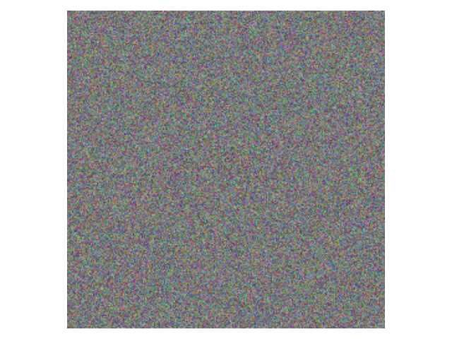

# Diffusion Models

Implementation of diffusion models for image generation, for self-educational purposes.

U-Net was taken from [2] to focus on the diffusion implementation.

<!-- ### Samples

Unconditional generation, 30 epochs on LSUN Churches with learning rate ``2e-4``. -->



### Usage

- Main training arguments (see `train.py` for more details):

```
python train.py \
--version        <str: version name for Tensorboard> \
--dataset        <str: dataset name (see code)> \
--dataset_path   <str: path to dataset> \
--unet_dim       <int: u-net dimension> \
--unet_dim_mults <list[int]: u-net layers config> \
--n_epochs       <int: num of epochs> \
--lr             <float: starting lr>
```

- Main sampling arguments (see `sample.py` for more details):

```
python sample.py \
--version        <str: version name for Tensorboard> \
--dataset        <str: dataset name (see code)> \
--dataset_path   <str: path to dataset> \
--unet_dim       <int: u-net dimension> \
--unet_dim_mults <list[int]: u-net layers config> \
--n_samples      <int: number of generated samples> \
--ckpt_path      <str: path to checkpoint>
```

- To track training/visualize samples,

```
tensorboard --logdir=lightning_logs
```

### References

[1] Ho, Jonathan, Ajay Jain, and Pieter Abbeel. "Denoising diffusion probabilistic models." Advances in neural information processing systems 33 (2020): 6840-6851.

[2] https://github.com/lucidrains/denoising-diffusion-pytorch 